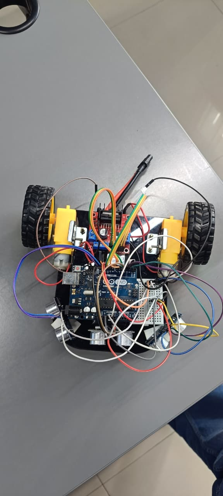
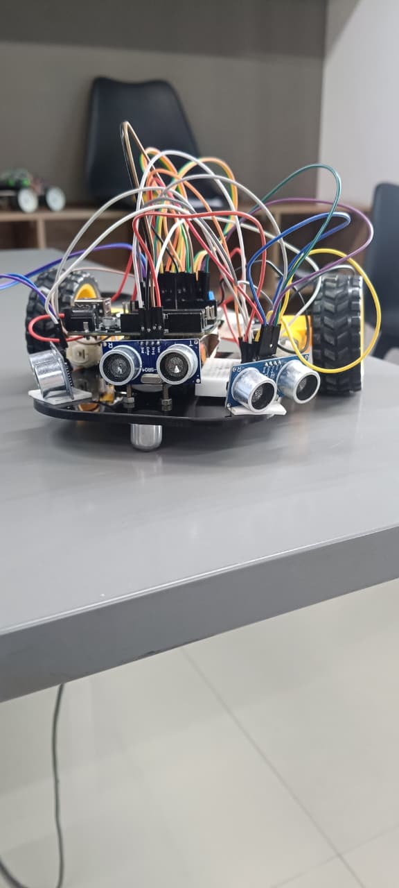

# 🤖 Obstacle Avoidance Rover

An autonomous obstacle avoidance rover built using an Arduino UNO, L298N motor driver, two 300 RPM DC geared motors, and three HC-SR04 ultrasonic sensors.

## 📌 Project Overview

The **Obstacle Avoidance Rover** is a small autonomous robotic vehicle that detects obstacles and automatically changes its direction to avoid collisions.

Three ultrasonic sensors are used to measure the distance in the **front, left, and right directions**. The Arduino UNO processes these distance measurements and controls the two DC motors through the L298N motor driver.

When there is no obstacle in front of the rover, it moves forward. When an obstacle is detected within the predefined distance, the rover stops, compares the available space on the left and right sides, and turns toward the side with more free space.

## 🎯 Objectives

- Build an autonomous obstacle avoidance rover.
- Detect obstacles using ultrasonic sensors.
- Measure distances in three directions.
- Control two DC motors using an L298N motor driver.
- Automatically select the safer direction when an obstacle is detected.
- Develop and test an Arduino-based robotic system.
- Provide adjustable parameters for different rover layouts and operating environments.

## 🛠️ Components Used

| Component | Quantity |
|---|---:|
| Arduino UNO | 1 |
| L298N Motor Driver | 1 |
| 300 RPM DC Geared Motors | 2 |
| HC-SR04 Ultrasonic Sensors | 3 |
| 12V Battery | 1 |
| Caster Wheel | 1 |
| Robot Chassis | 1 |
| Jumper Wires | As required |

## ⚙️ Working Principle

The rover continuously measures the distance using three HC-SR04 ultrasonic sensors.

### Normal Movement

If the front distance is greater than **23 cm**, the rover moves forward.

### Obstacle Detection

If the front distance is **23 cm or less**, an obstacle is considered to be present.

The rover then:

1. Stops the motors.
2. Checks the left and right distances.
3. Compares the available space on both sides.
4. Turns toward the side with greater available space.
5. Stops briefly after turning.
6. Continues moving forward and repeats the process.

### Decision Logic

```text
              Start
                |
                v
       Measure 3 distances
                |
                v
       Is front distance > 23 cm?
          /              \
        YES              NO
         |                |
         v                v
    Move Forward        Stop
                          |
                          v
                  Compare Left/Right
                     /          \
             Left > Right     Right >= Left
                  |                |
                  v                v
              Turn Left        Turn Right
                  \                /
                   \              /
                    v            v
                    Continue
```

## 📡 Ultrasonic Sensor Connections

| Sensor | Pin | Arduino UNO |
|---|---|---|
| Front HC-SR04 | VCC | 5V |
| | GND | GND |
| | TRIG | D4 |
| | ECHO | D7 |
| Left HC-SR04 | VCC | 5V |
| | GND | GND |
| | TRIG | D2 |
| | ECHO | D3 |
| Right HC-SR04 | VCC | 5V |
| | GND | GND |
| | TRIG | D12 |
| | ECHO | D13 |

## 🔌 L298N Motor Driver Connections

| L298N Pin | Arduino UNO |
|---|---|
| ENA | D5 |
| IN1 | D8 |
| IN2 | D9 |
| IN3 | D10 |
| IN4 | D11 |
| ENB | D6 |
| GND | GND |

### Motor Connections

| L298N | Motor |
|---|---|
| OUT1 | Left Motor Wire 1 |
| OUT2 | Left Motor Wire 2 |
| OUT3 | Right Motor Wire 1 |
| OUT4 | Right Motor Wire 2 |

## 🔋 Battery Connections

| 12V Battery | L298N |
|---|---|
| Positive (+) | 12V / VIN |
| Negative (-) | GND |

### Common Ground

The following must share a common ground:

- Arduino GND
- L298N GND
- Battery negative
- Front HC-SR04 GND
- Left HC-SR04 GND
- Right HC-SR04 GND

> **Important:** Do not connect the 12V battery directly to the Arduino 5V pin.

## 🚗 Motor Control

The L298N controls the direction and speed of both DC motors.

The current motor PWM speed used in the program is:

```text
130 / 255
```

The ENA and ENB pins are connected to Arduino PWM pins D5 and D6.

> **Important:** Remove the ENA and ENB jumpers on the L298N when using Arduino PWM control.

## 📏 Obstacle Detection Threshold

The current front obstacle detection threshold is:

```text
23 cm
```

- **Front distance > 23 cm** → Move forward
- **Front distance ≤ 23 cm** → Stop and avoid obstacle

## ⚙️ Adjustable Parameters

The following parameters can be modified in the Arduino code according to the rover's design and operating requirements:

- **Motor Speed:** The motor speed can be adjusted from **0 to 255** using PWM according to the required rover speed.
- **Front Detection Distance:** The front obstacle detection distance can be modified according to the **chassis size, sensor placement, and rover layout**.
- **Turning Delay:** The turning delay can be adjusted according to the **rover's turning angle, motor speed, and chassis design**.
- **Customization:** These parameters can be tuned during testing to achieve the desired obstacle-avoidance performance.

### Current Values

```cpp
int motorSpeed = 130;
```

```cpp
if (frontDistance > 23)
```

```cpp
delay(180);
```

These values can be changed according to the physical configuration and testing results.

## 💻 Software

- Arduino IDE
- Arduino C/C++
- Arduino UNO

## 📐 Chassis Design

The rover chassis was designed specifically for the obstacle avoidance system.

The chassis accommodates:

- Two 300 RPM DC geared motors
- One caster wheel
- Three ultrasonic sensors
- Arduino UNO
- L298N motor driver
- 12V battery
- Supporting electronic components

The **DXF design file** is provided for fabrication and further modification.

### Chassis Design File

[📐 View / Download Chassis DXF](Chassis_Design/Part%20Studio%201%20-%20Sketch%202.dxf)

## 📷 Rover Views

### Top View



### Side View



## 🎥 Demonstration

A demonstration video showing the obstacle avoidance rover in operation is included in the repository.

[▶️ View Demo Video](Demo_Video.mp4)

## 📄 Documentation

Detailed hardware connection information is provided in the following document:

[📄 Pin Details](Pin_Details.docx)

The document contains the connection details for:

- Arduino UNO
- L298N motor driver
- HC-SR04 ultrasonic sensors
- DC motors
- 12V battery

## 📁 Repository Structure

```text
obstacle-avoidance-rover/
│
├── Arduino_Code/
│   └── obstacle_avoidance_rover.ino
│
├── Chassis_Design/
│   └── Part Studio 1 - Sketch 2.dxf
│
├── Images/
│   ├── side_view.jpeg
│   └── top_view.jpeg
│
├── Demo_Video.mp4
├── Pin_Details.docx
└── README.md
```

## 🚀 Future Improvements

- Add Bluetooth or Wi-Fi remote control.
- Add servo-mounted ultrasonic scanning.
- Improve obstacle avoidance using smoother turning.
- Add speed control based on obstacle distance.
- Add battery voltage monitoring.
- Add an OLED/LCD display for distance information.
- Improve the chassis and mechanical design.
- Implement more advanced path-planning algorithms.

## 👥 Project Highlights

This project demonstrates the integration of:

- Embedded systems
- Robotics
- Ultrasonic sensing
- Motor control
- Autonomous navigation
- Arduino programming
- Mechanical chassis design
- Hardware-software integration

---

**Built using Arduino UNO, L298N motor driver, three HC-SR04 ultrasonic sensors, two 300 RPM DC geared motors, a 12V battery, and a custom-designed rover chassis.**
